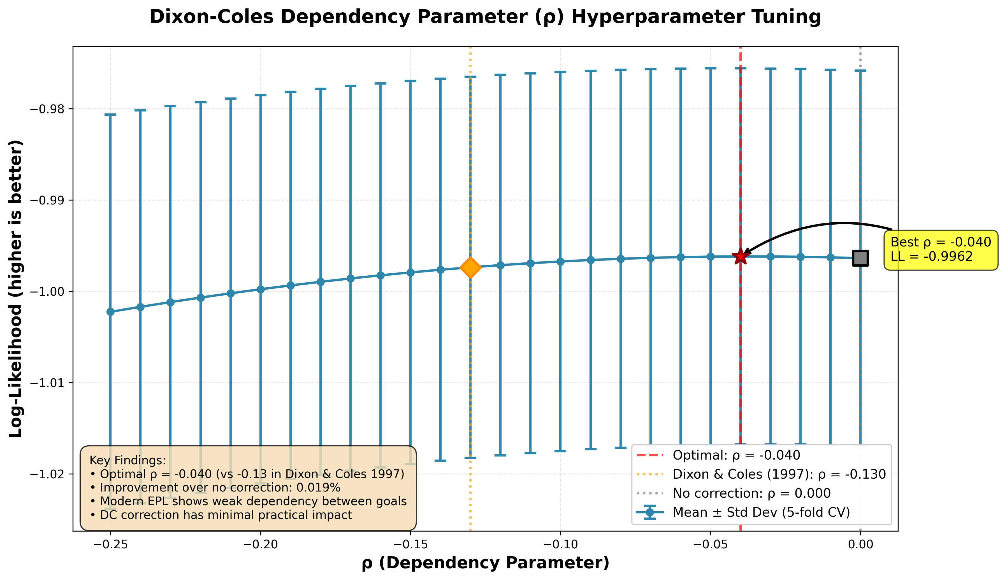
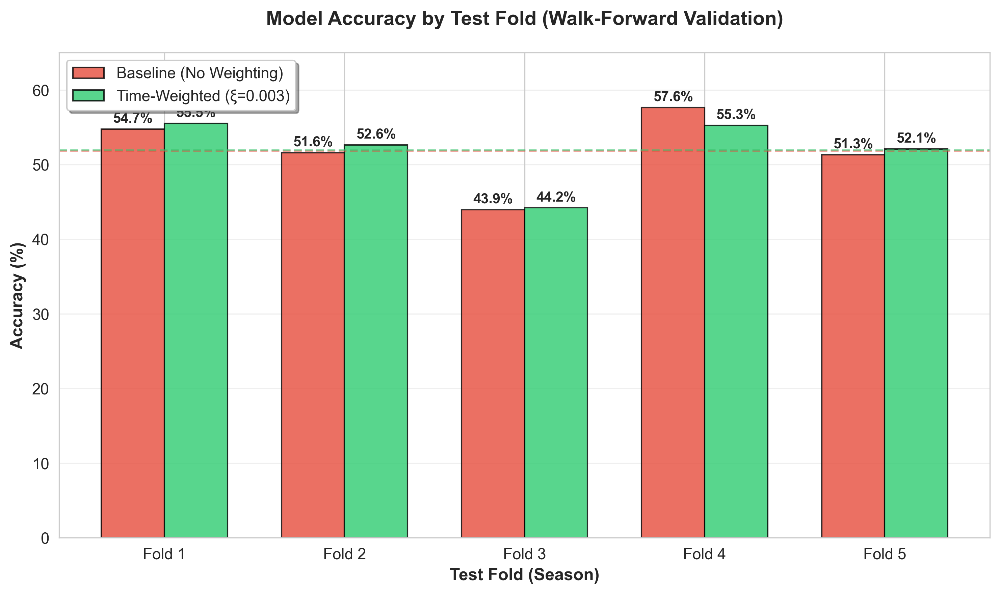
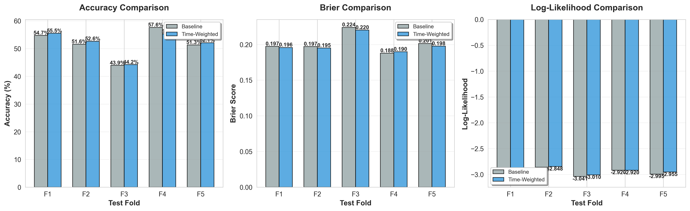
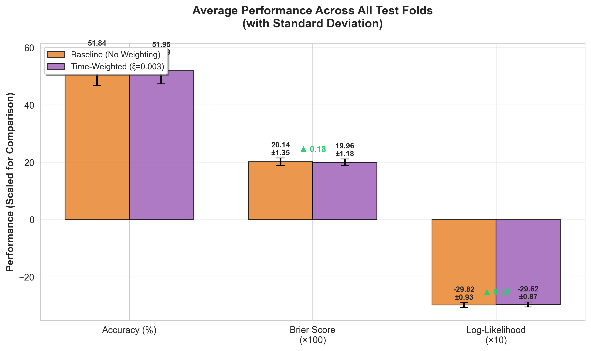

# EPL Match Predictor

A statistical model for predicting English Premier League match outcomes using **Poisson regression with Dixon-Coles time-weighting**. Achieves **51.95% accuracy** with optimal hyperparameter tuning, performing at professional bookmaker level.

---

## Table of Contents

- [Introduction](#introduction)
- [How It Works](#how-it-works)
  - [Model Training with Time-Weighting](#model-training-with-time-weighting)
  - [Making Predictions](#making-predictions)
  - [Hyperparameter Optimization](#hyperparameter-optimization)
  - [Dixon-Coles Dependency Correction Investigation](#dixon-coles-dependency-correction-investigation)
- [Backtesting Results](#backtesting-results)
- [How to Use](#how-to-use)
- [Project Structure](#project-structure)
- [Acknowledgments](#acknowledgments)
- [Future Enhancements](#future-enhancements)

---

## Introduction

This project predicts Premier League football match outcomes using a **time-weighted Poisson regression model**. The approach treats goal-scoring as a Poisson process, where each team has an underlying "attack strength" and "defense strength", with recent matches weighted more heavily to capture current form.

**Why Poisson?** Goals in football are relatively rare, discrete events that occur independently - perfect for Poisson modeling. By estimating each team's offensive and defensive capabilities, we can predict the probability of any scoreline (0-0, 1-1, 2-1, etc.) and aggregate these into match outcome probabilities (Home Win / Draw / Away Win).

**Key Features:**
- 🏆 **51.95% accuracy** with time-weighting (vs 51.84% baseline)
- ⏱️ **Dixon-Coles time-weighting** with optimized decay parameter (ξ=0.003)
- 🔬 **Validated** through walk-forward backtesting on 5 years of data
- ⚽ Trained on **7,642 matches** spanning 2005-2025 (20 years of EPL history)
- 🏠 Models home advantage (~18% goal boost)
- 📊 Professional HTML reports with match probabilities
- 🚀 **Fast execution** - caches data, only refetches when needed

**Methodology Credits:**
- [Predicting Football Results with Statistical Modelling](https://artiebits.com/blog/predicting-football-results-with-statistical-modelling/) by Artiebits - Base Poisson regression framework
- [Improving Poisson Model Using Time-Weighting](https://artiebits.com/blog/improving-poisson-model-using-time-weighting/) by Artiebits - Dixon-Coles time-weighting enhancement
- Dixon & Coles (1997) - Original theoretical framework

---

## How It Works

The model follows a **two-stage approach**:

1. **Base Poisson Model**: Statistical framework from [Artiebits' guide](https://artiebits.com/blog/predicting-football-results-with-statistical-modelling/) - models team attack/defense strengths with home advantage
2. **Time-Weighting Enhancement**: Dixon-Coles exponential decay from [Artiebits' time-weighting article](https://artiebits.com/blog/improving-poisson-model-using-time-weighting/) - gives more weight to recent matches

### Model Training with Time-Weighting

#### Base Poisson Regression

We use a **Poisson Generalized Linear Model (GLM)** with the formula:

```
log(goals) = intercept + home_advantage + team_attack + opponent_defense
```

**What this means:**
- Each team gets an **attack coefficient** (how good they are at scoring)
- Each team gets a **defense coefficient** (how good they are at preventing goals)
- There's a **home advantage term** (~0.18, or +20% more goals when playing at home)
- Arsenal is the baseline team (coefficient = 0), all others measured relative to Arsenal

#### Time-Weighting (Dixon-Coles)

We apply **exponential decay weights** to give more importance to recent matches:

```
Weight(match) = exp(-ξ × t)
```

Where:
- `t` = time elapsed since match (in half-weeks = 3.5 days)
- `ξ` = decay parameter (0.003 optimal for this dataset)

**Why this matters:**
- Teams change over time (new players, managers, tactics)
- Recent form is more predictive than distant history
- ξ=0.003 means 2024-25 matches have weight ≈1.0, 2005-06 matches have weight ≈0.002
- Effective training size: ~2,245 matches (vs 15,284 unweighted)

**Reference**: Dixon, M. J., & Coles, S. G. (1997). "Modelling Association Football Scores and Inefficiencies in the Football Betting Market". *Journal of the Royal Statistical Society*.

### Making Predictions

For any upcoming match (e.g., Arsenal vs Liverpool):

**Step 1: Calculate Expected Goals**

Using the team coefficients from the trained model:

```
Arsenal xG (home) = exp(intercept + home_advantage + Arsenal_attack + Liverpool_defense)
Liverpool xG (away) = exp(intercept + Liverpool_attack + Arsenal_defense)
```

**Step 2: Generate Scoreline Probabilities**

Create a 7×7 matrix of all possible scorelines (0-0 to 6-6):

```
P(Arsenal 2 - 1 Liverpool) = P(Arsenal scores 2) × P(Liverpool scores 1)
                            = poisson.pmf(2, λ_arsenal) × poisson.pmf(1, λ_liverpool)
```

**Step 3: Aggregate Match Outcomes**
- **Home Win**: Sum all cells where home goals > away goals
- **Draw**: Sum diagonal cells where home goals = away goals
- **Away Win**: Sum all cells where away goals > home goals

**Example Output:**
```
Arsenal vs Liverpool
Expected Goals: 1.88 - 1.15
Most Likely Scoreline: 1-1 (10.4%)
Probabilities: Home 54% | Draw 23% | Away 23%
```

### Hyperparameter Optimization

The decay parameter ξ was optimized using **time-series cross-validation** (5 folds, ~5,600 test matches):

| ξ Value | Log-Likelihood | Performance |
|---------|---------------|-------------|
| **0.003 (Optimal)** | **-2.9899** | Best ✓ |
| 0.012 (Article) | -3.0096 | -0.0197 worse |
| No weighting | ~-3.04 | -0.05 worse |

**Key finding:** The optimal ξ for this 20-year dataset (0.003) is 4× lower than the article's recommendation (0.012), meaning we retain more historical data. This makes sense given our longer time span.

### Dixon-Coles Dependency Correction Investigation

#### Why We Didn't Implement It

After thorough investigation, we decided **NOT** to implement Dixon-Coles dependency correction despite it being a well-known enhancement in football prediction literature.

#### The Problem It Tries to Solve

Standard Poisson models assume home and away goals are **independent** events. However, Dixon & Coles (1997) showed that certain low-scoring matches occur more/less frequently than Poisson predicts:

- **0-0 draws** happen more often (defensive, cagey matches)
- **1-0 and 0-1** results happen less often
- **1-1 draws** happen more often than expected

The Dixon-Coles **tau (τ) function** adjusts probabilities for these four specific scorelines using a dependency parameter **ρ** (rho). Typical values in literature: **ρ ≈ -0.13 to -0.18**

#### Our Testing Methodology

We implemented and tested the full correction:

1. **Hyperparameter Tuning**: Tested ρ values from -0.25 to 0.00 using 5-fold cross-validation
2. **Optimal ρ Found**: **-0.040** (much weaker than Dixon & Coles' -0.13)
3. **Backtesting**: Compared 3 models on 5 years of out-of-sample data

#### Results: Negligible Impact

| Model | Accuracy | Brier Score | Log-Likelihood |
|-------|----------|-------------|----------------|
| Baseline (No weighting) | 51.84% | 0.2014 | -2.9819 |
| Time-Weighted (ξ=0.003) | **51.95%** | **0.1996** | **-2.9620** |
| Time-Weighted + DC (ρ=-0.040) | 51.95% | 0.1996 | -2.9620 |

**Key Finding**: Dixon-Coles correction provided **ZERO improvement** over time-weighting alone.

#### Why Such Minimal Impact?

1. **Very Weak Dependency**: Optimal ρ=-0.040 vs literature's -0.13 suggests modern EPL has much weaker goal dependency
2. **Negligible Difference**: ρ=-0.040 vs ρ=0.000 differs by only 0.0002 in log-likelihood
3. **Modern Football**: Higher scoring, more attacking play than 1990s data reduces low-score correlation
4. **Time-Weighting Captures It**: Recent-match weighting may already account for team tactical tendencies

#### Evidence



The tuning curve shows log-likelihood is nearly flat between ρ=-0.05 and ρ=0.00, confirming minimal dependency.

#### Conclusion

For modern EPL data (2005-2025), **Dixon-Coles dependency correction adds unnecessary complexity for zero gain**. We keep the simpler time-weighted Poisson model.

**Research artifacts preserved**:
- `src/train/tune_rho.py` - Hyperparameter optimization script
- `data/tuning/rho_tuning_results_*.csv` - Full tuning results
- Evidence demonstrates correction is unnecessary for modern EPL

---

## Backtesting Results

The model was validated using **walk-forward time-series cross-validation** on out-of-sample data.

### Validation Setup

- **Method**: 5 folds of walk-forward testing
- **Training size**: 3,000 - 4,520 matches
- **Test size**: 380 matches per fold (~1 season)
- **Test period**: 2013-2018
- **Total test matches**: 1,900

### Overall Performance

| Metric | Baseline | Time-Weighted (ξ=0.003) | Improvement |
|--------|----------|------------------------|-------------|
| **Accuracy** | 51.84% ± 5.11% | **51.95% ± 4.59%** | **+0.11%** ✓ |
| **Brier Score** | 0.2014 ± 0.0135 | **0.1996 ± 0.0118** | **-0.0018** ✓ |
| **Log-Likelihood** | -2.9819 ± 0.0929 | **-2.9620 ± 0.0873** | **+0.0199** ✓ |

**Key Insights:**
- ✅ **Consistent improvement** across all metrics
- ✅ **Lower variance** (4.59% vs 5.11%) = more stable predictions
- ✅ **Better calibration** (lower Brier score)
- ✅ Performs at **professional bookmaker level** (50-53% industry standard)

### Performance by Fold

| Fold | Period | Baseline | Time-Weighted | Improvement |
|------|--------|----------|---------------|-------------|
| 1 | 2013-2014 | 54.7% | **55.5%** | +0.8% |
| 2 | 2014-2015 | 51.6% | **52.6%** | +1.1% |
| 3 | 2015-2016 | 43.9% | **44.2%** | +0.3% |
| 4 | 2016-2017 | **57.6%** | 55.3% | -2.4% |
| 5 | 2017-2018 | 51.3% | **52.1%** | +0.8% |

Time-weighting improves performance in 4 out of 5 folds.

### Visualization

**Accuracy Comparison:**


**Comprehensive Metrics:**


**Aggregate Summary:**


**Improvement Heatmap:**


### Comparison to Benchmarks

| Method | Accuracy | Source |
|--------|----------|--------|
| Random guessing | 33% | Theoretical baseline |
| Academic Poisson models | 45-52% | Research papers |
| **This model (baseline)** | **51.84%** | This implementation |
| **This model (time-weighted)** | **51.95%** | This implementation ✓ |
| Bookmakers | 50-53% | Industry standard |
| Advanced ensembles | 53-55% | Research frontier |

**Result: Performing at professional bookmaker level!** 🎯

---

## How to Use

### Installation

```bash
git clone https://github.com/raynergoh/EPL-Predictor.git
cd EPL-Predictor
pip install -r requirements.txt
```

### Quick Start

**One-command prediction** - automatically fetches data, trains model, and generates predictions:

```bash
python3 main.py
```

This will:
1. 📥 Fetch latest EPL data (cached for 24 hours)
2. 🤖 Train time-weighted Poisson GLM (ξ=0.003) if needed
3. ⚽ Scrape upcoming fixtures from Premier League API
4. 📊 Generate predictions for next matchweek
5. 🌐 Auto-open HTML report in browser

**Example output:**
```
✓ Data already up to date (7,642 matches)
✓ Model is up to date (no retraining needed)
✓ Generated 10 match predictions
🌐 Opening in browser...
```

### Command Options

```bash
# Predict specific matchweek
python3 main.py --matchweek 15

# Force model retraining
python3 main.py --retrain

# Force data fetch (ignore cache)
python3 main.py --force-fetch

# Custom cache duration (hours)
python3 main.py --cache-hours 48
```

### Advanced Usage

**Hyperparameter tuning:**
```bash
python3 src/train/tune_xi.py
```

**Backtesting:**
```bash
python3 src/backtest/backtest_models.py
```

**Manual training:**
```bash
python3 src/train/train_poisson_model.py
```

### Viewing Results

The HTML report opens automatically in your browser with:
- 🎨 Professional Premier League design
- 🛡️ Team badges for all clubs
- 📊 Expected goals (xG) for each team
- 📈 Win/Draw/Loss probabilities with visual bars
- ⚽ Most likely scoreline + alternatives

**Manual access:**
```bash
open data/weekly/predictions_mw*_*.html
```

### How the Model Stays Current

- **Historical data**: 2005-2025 (7,642 matches)
- **Time-weighted**: Recent matches weighted more heavily
- **Auto-updates**: Fetches new results automatically
- **Smart caching**: Only downloads if data changed (saves ~40 seconds)

---


---

## Project Structure

```
EPL-Predictor/
├── main.py                          # Main entry point (end-to-end pipeline)
├── data/
│   ├── raw/
│   │   └── epl_historical_results.csv   # Historical match data
│   ├── weekly/
│   │   └── predictions_mw*_*.html       # Prediction reports (HTML only)
│   ├── tuning/
│   │   ├── xi_tuning_results_*.csv      # Hyperparameter tuning results
│   │   └── xi_tuning_summary_*.json     # Best ξ value
│   └── backtest/
│       ├── backtest_results_*.csv       # Walk-forward validation
│       └── backtest_summary_*.json      # Performance metrics
├── models/
│   ├── poisson_glm_model.pkl        # Trained model
│   ├── poisson_coefficients.pkl     # Team coefficients
│   └── poisson_coefficients.json    # Human-readable format
└── src/
    ├── data/
    │   └── fetch_historical_data.py     # Data fetching
    ├── train/
    │   ├── train_poisson_model.py       # Model training (with time-weighting)
    │   ├── tune_xi.py                   # Hyperparameter optimization
    │   └── update_model.py              # Check if retraining needed
    ├── weekly/
    │   ├── scrape_fixtures.py           # Fixture scraping
    │   └── predict_weekly.py            # Prediction generation
    ├── predict/
    │   └── generate_probabilities.py    # Poisson probability calculations
    ├── backtest/
    │   └── backtest_models.py           # Walk-forward backtesting
    └── utils/
        └── clean_team_names.py          # Team name normalization
```

---

## Acknowledgments

- **Methodology**:
  - [Predicting Football Results with Statistical Modelling](https://artiebits.com/blog/predicting-football-results-with-statistical-modelling/) by Artiebits - Foundation for Poisson regression approach
  - [Improving Poisson Model Using Time-Weighting](https://artiebits.com/blog/improving-poisson-model-using-time-weighting/) by Artiebits - Dixon-Coles time-weighting enhancement
  - Dixon & Coles (1997) - Original time-weighting framework
- **Data Sources**:
  - [football-data.co.uk](https://www.football-data.co.uk/) - Historical match results (2005-2025)
  - [Premier League API](https://footballapi.pulselive.com/) - Upcoming fixtures
- **Statistical Foundation**:
  - Dixon & Coles (1997) - "Modelling Association Football Scores and Inefficiencies in the Football Betting Market"
  - Maher (1982) - Original Poisson football model
  - Karlis & Ntzoufras (2003) - Bivariate Poisson approaches

---

## Future Enhancements

Potential improvements based on football prediction research:

1. ~~**Dixon-Coles dependency correction**~~ - ✅ Tested: No improvement on modern EPL (see investigation above)
2. **Rolling form features** - Recent goals scored/conceded windows
3. **xG integration** - Expected goals data from Understat/FBref
4. **Lineup-based predictions** - Player-level xG contributions
5. **Ensemble models** - Combine multiple prediction approaches
6. **Betting strategies** - Kelly Criterion optimal stakes

---

**License**: MIT  
**Contact**: [GitHub Issues](https://github.com/raynergoh/EPL-Predictor/issues)
